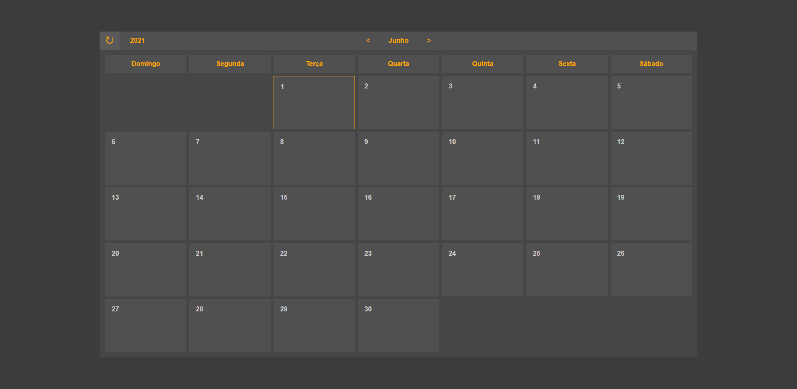

# Calendar
A simple calendar using pure HTML, CSS and JavaScript to be used in a future project using Node.js and React.js.

## Getting started
1. Clone this repo using `git clone https://github.com/bruno-remeikis/calendario.git`
2. Open the `index.html` in some browser

## Demonstration

